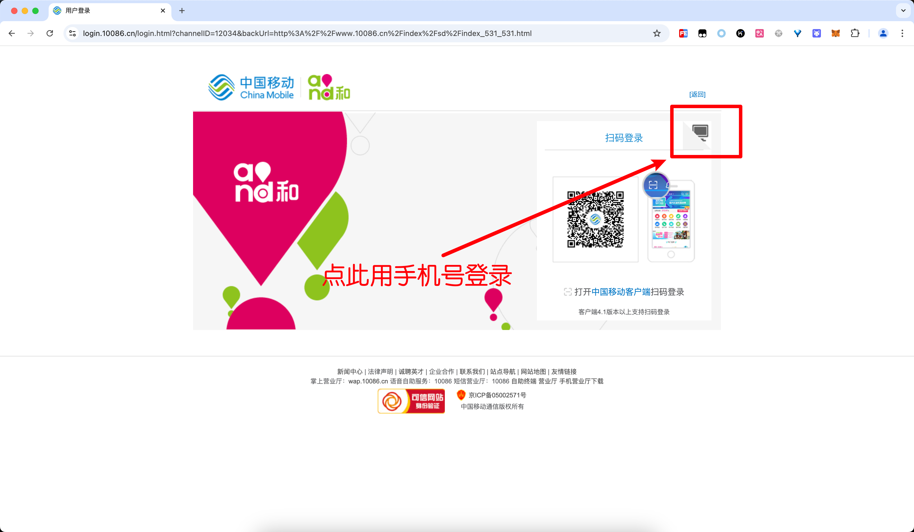
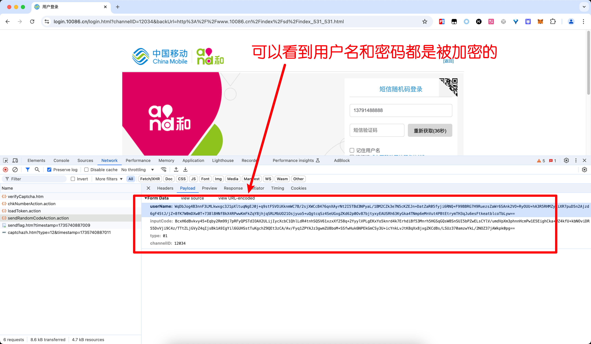
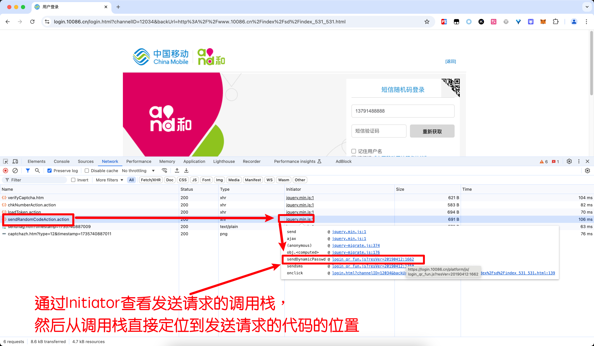
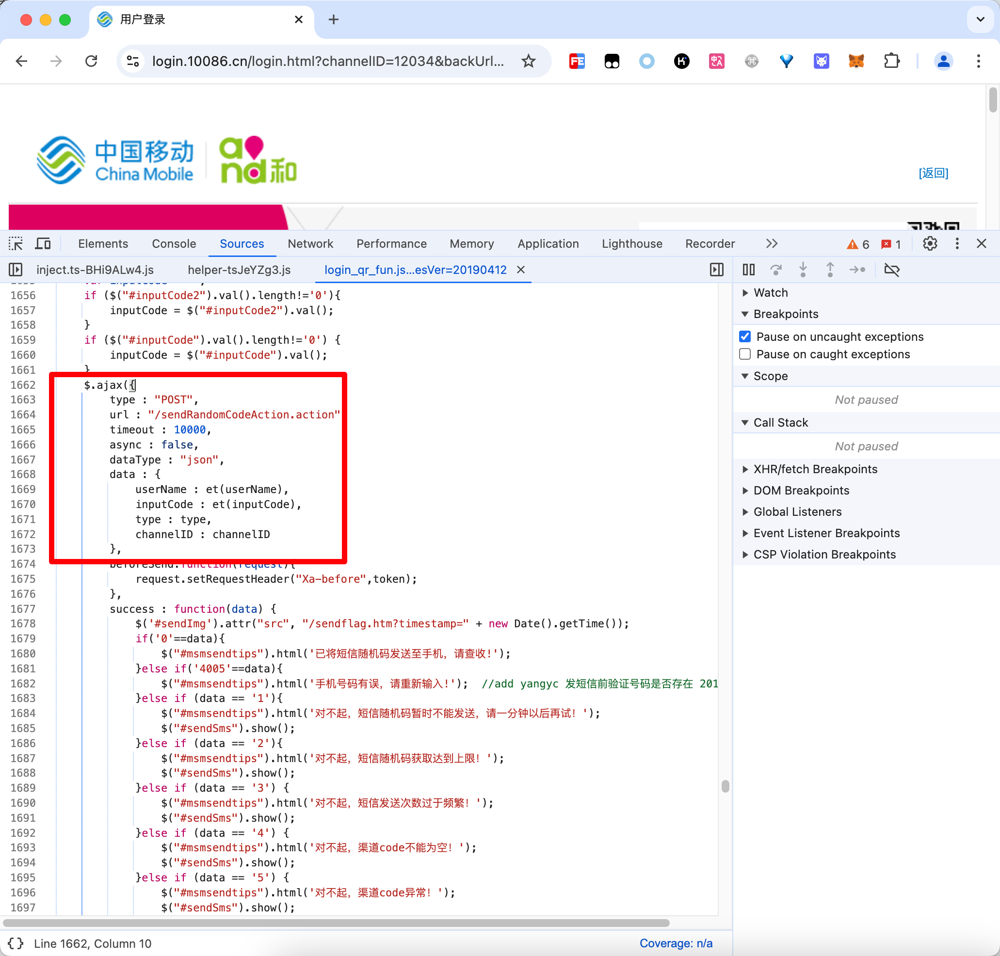
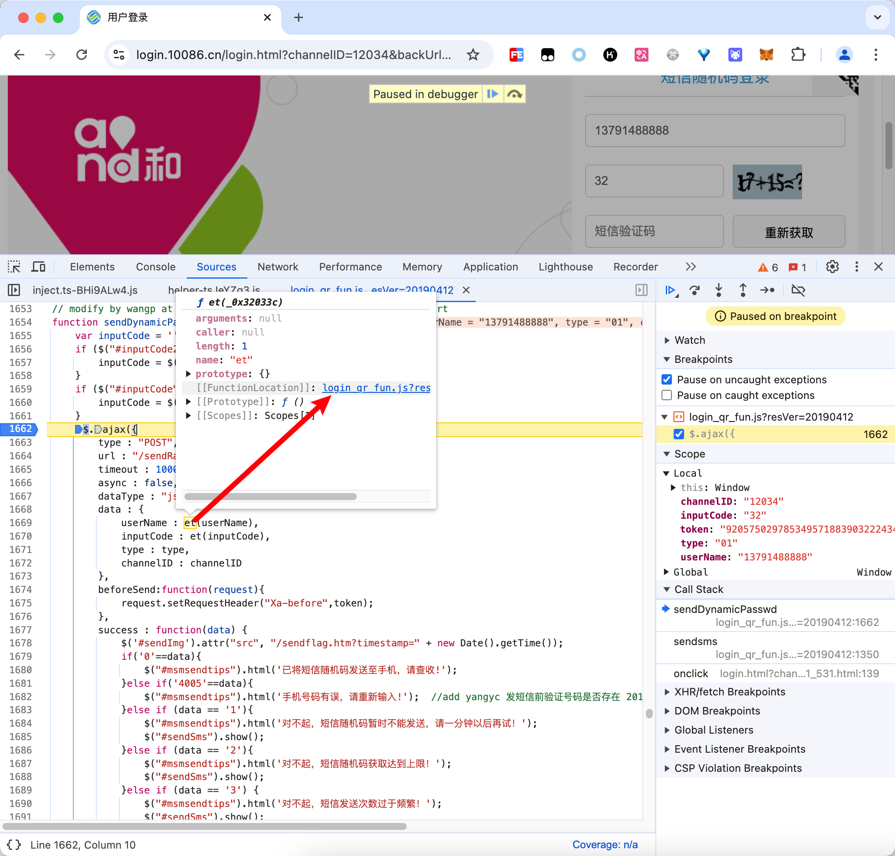
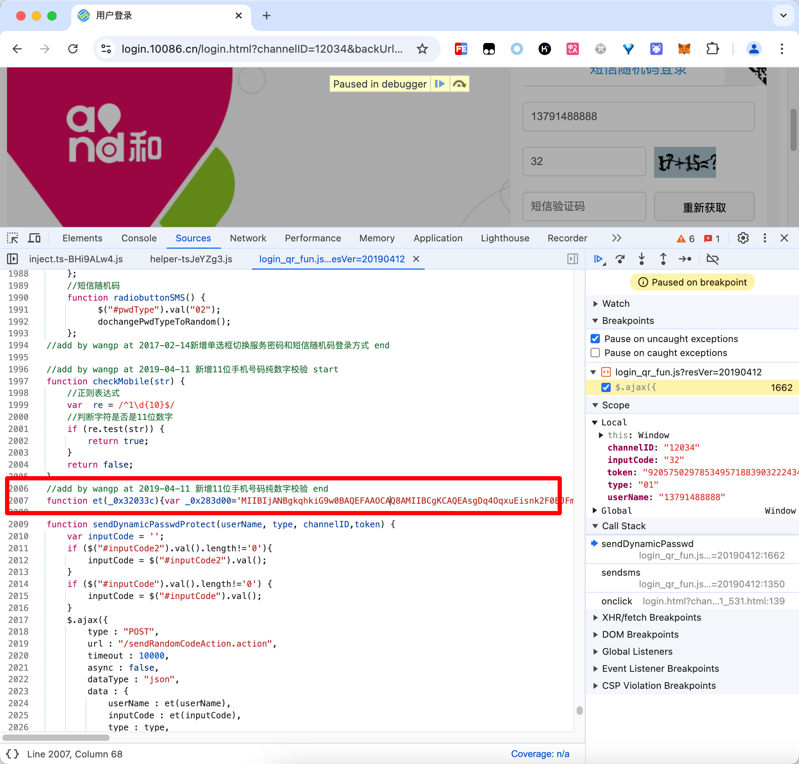

# 10086中国移动登录

B站视频：https://www.bilibili.com/video/BV1RH6fYPEkn/

代码仓库：https://github.com/JSREP/login.10086.cn-RE

全部文章索引：https://github.com/JSREP/jsrep-index

逆向工具集：https://github.com/JSREI


# 一、逆向目标

```
https://login.10086.cn/login.html?channelID=12034&backUrl=http%3A%2F%2Fwww.10086.cn%2Findex%2Fsd%2Findex_531_531.html
```

在登录界面有手机号登录的选项：



发送验证码的时候手机号是被加密的：



我们的目标就是搞清楚这两个参数加密的逻辑。

# 二、分析过程

通过请求的Initiator找到构造参数的地方：



跟进去：



打一个断点，跟进去et函数：



看到了一坨东西：



把代码复制出来看一下：

```js
//add by wangp at 2019-04-11 新增11位手机号码纯数字校验 end
function et(_0x32033c){var _0x283d00='MIIBIjANBgkqhkiG9w0BAQEFAAOCAQ8AMIIBCgKCAQEAsgDq4OqxuEisnk2F0EJFmw4xKa5IrcqEYHvqxPs2CHEg2kolhfWA2SjNuGAHxyDDE5MLtOvzuXjBx/5YJtc9zj2xR/0moesS+Vi/xtG1tkVaTCba+TV+Y5C61iyr3FGqr+KOD4/XECu0Xky1W9ZmmaFADmZi7+6gO9wjgVpU9aLcBcw/loHOeJrCqjp7pA98hRJRY+MML8MK15mnC4ebooOva+mJlstW6t/1lghR8WNV8cocxgcHHuXBxgns2MlACQbSdJ8c6Z3RQeRZBzyjfey6JCCfbEKouVrWIUuPphBL3OANfgp0B+QG31bapvePTfXU48TYK0M5kE+8LgbbWQIDAQAB';var _0x1defd6=new JSEncrypt();_0x1defd6['setPublicKey'](_0x283d00);var _0x4bd6d3=_0x1defd6['encrypt'](_0x32033c);return _0x4bd6d3;}
```

可以看到，是使用RSA进行加密，在node中模拟：

```js
const window = {};
// 引入 jsencrypt
const JSEncrypt = require('node-jsencrypt');

//add by wangp at 2019-04-11 新增11位手机号码纯数字校验 end
function et(_0x32033c) {
    var _0x283d00 = 'MIIBIjANBgkqhkiG9w0BAQEFAAOCAQ8AMIIBCgKCAQEAsgDq4OqxuEisnk2F0EJFmw4xKa5IrcqEYHvqxPs2CHEg2kolhfWA2SjNuGAHxyDDE5MLtOvzuXjBx/5YJtc9zj2xR/0moesS+Vi/xtG1tkVaTCba+TV+Y5C61iyr3FGqr+KOD4/XECu0Xky1W9ZmmaFADmZi7+6gO9wjgVpU9aLcBcw/loHOeJrCqjp7pA98hRJRY+MML8MK15mnC4ebooOva+mJlstW6t/1lghR8WNV8cocxgcHHuXBxgns2MlACQbSdJ8c6Z3RQeRZBzyjfey6JCCfbEKouVrWIUuPphBL3OANfgp0B+QG31bapvePTfXU48TYK0M5kE+8LgbbWQIDAQAB';
    var _0x1defd6 = new JSEncrypt();
    _0x1defd6['setPublicKey'](_0x283d00);
    var _0x4bd6d3 = _0x1defd6['encrypt'](_0x32033c);
    return _0x4bd6d3;
}

console.log(et("CC11001100"));
// Output:
// evm9X+EhuSKdp+2jGAPZUMVQTKO7p2RNHyd+xO9JuMxY0Wz1caXNtAoAK0wAGDixyGf95HuCWEtpdJZYuTCYyP1eA23Ukds+N5fUAHBzyoI/VgbZJSngK/O1IQwUh1ywOdsEB/LUGLq3oikrMYg3JFK5XfVvx1G+eqDveFGzB4++0Apdzn2MV4M35RtKuZhUudkfPRt4YyHsvzpR2+ie3JJvtczeExP6OR4nj0yIfRiOX6VcyajhkxgWzMRkNCkp7Dnv4T4wZJXrkXrUYw0VnJHECSUIXrgF67qnKjj/3enC8h1kHRLR4RctxCnVOEWssFjJmzhZ5YjnWnS0wgbXsA==
```

至此分析完毕。


# 三、逆向技术交流群

扫码加入逆向技术交流群：


如群二维码过期，可以加我个人微信（CC11001100-weixin），发送【逆向群】拉你进群：


[点此](https://t.me/jsreijsrei)或扫码加入TG交流群：


