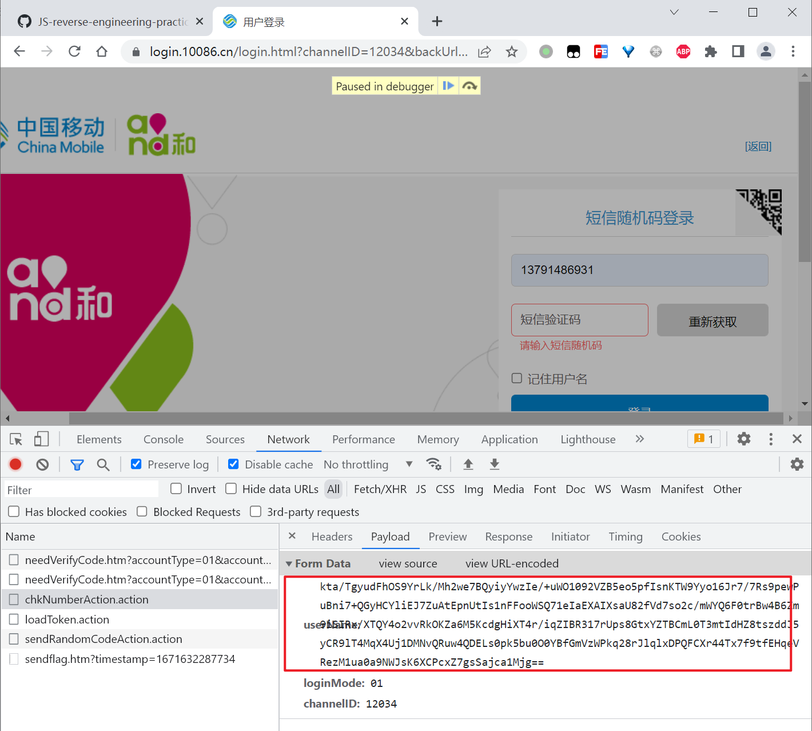
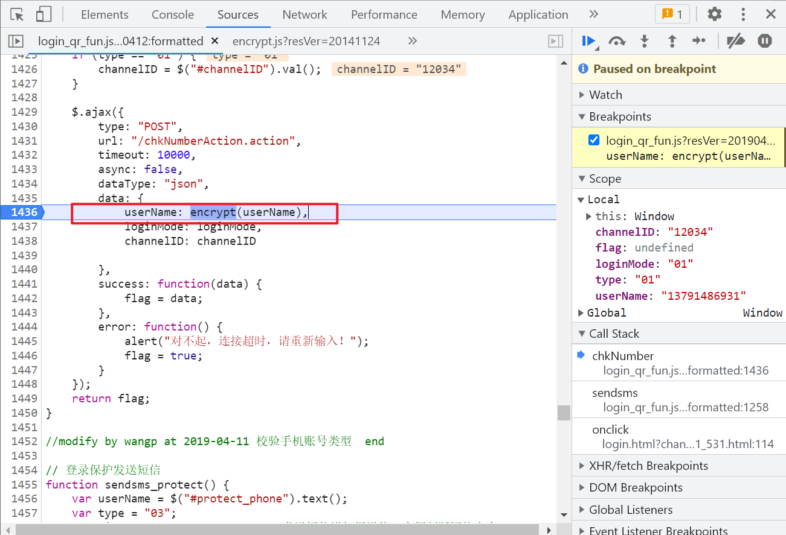

# 10086中国移动登录

目标网址：

```
https://login.10086.cn/login.html?channelID=12034&backUrl=http%3A%2F%2Fwww.10086.cn%2Findex%2Fsd%2Findex_531_531.html
```

发送验证码的时候手机号是被加密的：



通过请求的Initiator找到构造参数的地方：



跟进去`encrypt`，可以看到只是一个RSA加密：

```js
/*Obfuscated by JShaman.com*/
function encrypt(_0x32033c) {
    var _0x283d00 = 'MIIBIjANBgkqhkiG9w0BAQEFAAOCAQ8AMIIBCgKCAQEAsgDq4OqxuEisnk2F0EJFmw4xKa5IrcqEYHvqxPs2CHEg2kolhfWA2SjNuGAHxyDDE5MLtOvzuXjBx/5YJtc9zj2xR/0moesS+Vi/xtG1tkVaTCba+TV+Y5C61iyr3FGqr+KOD4/XECu0Xky1W9ZmmaFADmZi7+6gO9wjgVpU9aLcBcw/loHOeJrCqjp7pA98hRJRY+MML8MK15mnC4ebooOva+mJlstW6t/1lghR8WNV8cocxgcHHuXBxgns2MlACQbSdJ8c6Z3RQeRZBzyjfey6JCCfbEKouVrWIUuPphBL3OANfgp0B+QG31bapvePTfXU48TYK0M5kE+8LgbbWQIDAQAB';
    var _0x1defd6 = new JSEncrypt();
    _0x1defd6['setPublicKey'](_0x283d00);
    var _0x4bd6d3 = _0x1defd6['encrypt'](_0x32033c);
    return _0x4bd6d3;
}
function encrypts(_0x3f42dd) {
    var _0x3bc27a = CryptoJS['enc']['Utf8']['parse']('8ujhbnjhgfvb12bh');
    var _0x31517b = CryptoJS['enc']['Utf8']['parse'](_0x3f42dd);
    var _0x2214ef = CryptoJS['AES']['encrypt'](_0x31517b, _0x3bc27a, {
        'mode': CryptoJS['mode']['ECB'],
        'padding': CryptoJS['pad']['Pkcs7']
    });
    return _0x2214ef['toString']();
}
function decrypts(_0x3a12fd) {
    var _0x59521c = CryptoJS['enc']['Utf8']['parse']('8ujhbnjhgfvb12bh');
    var _0x486a8b = CryptoJS['AES']['decrypt'](_0x3a12fd, _0x59521c, {
        'mode': CryptoJS['mode']['ECB'],
        'padding': CryptoJS['pad']['Pkcs7']
    });
    return CryptoJS['enc']['Utf8']['stringify'](_0x486a8b)['toString']();
}

```

至此分析完毕。


